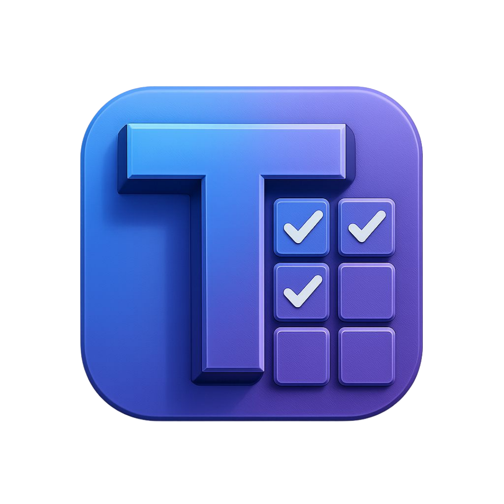
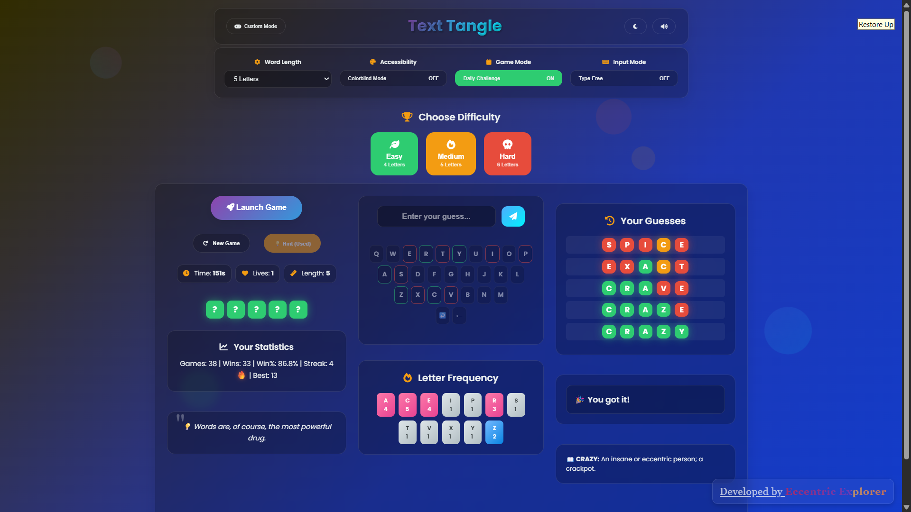

<div align="center"></div>

# <div align="center">TEXTTANGLE</div>

## A JavaScript-based advanced feature-rich wordle

TextTangle is an advanced Wordle which provides a seamless and interactive experience for guessing a secret word, complete with a sleek, animated interface and robust features. Test your vocabulary and deduction skills as you try to unravel the hidden word within a set number of chances\!

## ✨ Features

  * **Word Guessing Gameplay**: Classic word guessing mechanics where you deduce a hidden word.
  * **Daily Mode**: Challenge yourself with a new word every day.
  * **Custom Word Input (Basic Multi-Player)**: Enter your own custom word to play with friends or practice.
  * **Adjustable Word Length**: Choose words from 4 to 7 letters in length.
  * **Difficulty Levels**: Select from Easy, Medium, and Hard difficulties...
  * **Sound Toggle**: Turn game sounds on or off for a personalised experience.
  * **Colorblind Mode**: An accessibility feature to enhance visibility for colorblind users or for bringing in a new twist. Replaces color feedback with C/E/W (Correct/Error/Wrong).
  * **Real-time Stats Tracking**: Keep track of your total games played, wins, losses, and current streak.
  * **Word Definition and Quote Display**: Get the definition of the secret word after the game ends along with a random quote.
  * **Letter Frequency Heatmap**: Visualise the frequency of letters in your guesses to strategize better.
  * **Guess History**: Review your previous guesses in a clear, organised list.
  * **Virtual Keyboard**: An interactive on-screen keyboard for easy input.
  * **Responsive and Interactive UI**: Enjoy a smooth experience across various devices with dynamic animations and transitions.
  * **Dark Mode**: Toggle between light and dark themes for visual comfort.

## 🚀 Live Demo

Experience TextTangle live here: [**TextTangle**](https://www.google.com/search?q=https://eccentriccoder01.github.io/TextTangle)

 <div align="center">
 <p>

[](https://github.com/ellerbrock/open-source-badges/)


 </p>
 </div>

## 📸 Screenshots

### Light Mode

<div align="center"></div>

### Dark Mode

<div align="center"></div>

## 📺 Video Explanation

For a detailed walkthrough of TextTangle's features and how to use them, check out this video:

**[Insert YouTube Video Link Here]**

## 🛠️ Technologies Used

  * **HTML5**: For structuring the web content.
  * **CSS3**: For styling and layout, including modern glassmorphism effects and animations.
  * **JavaScript (ES6+)**: For game logic and interactive elements.
  * **jQuery**: Simplifies DOM manipulation and event handling.
  * **Font Awesome**: Provides vector icons.
  * **Canvas Confetti**: For celebratory animations on game win.

## ⚙️ How to Run Locally

1.  **Clone the repository:**

    ```bash
    git clone https://github.com/eccentriccoder01/TextTangle.git
    ```

2.  **Navigate to the project directory:**

    ```bash
    cd TextTangle
    ```

3.  **Open with a Live Server:**
    You can simply open `index.html` directly in your browser, or for a better development experience (especially for features like API calls), use a local server:
      * If you have VS Code, use the "Live Server" extension.
      * Alternatively, if you have Node.js installed, you can install `http-server` globally:
        ```bash
        npm install -g http-server
        ```
        Then navigate to your project directory and run:
        ```bash
        http-server
        ```
    Your default browser will open the application, usually at `http://127.0.0.1:5500` or `http://localhost:8080`.

## Issue Creation ✴
Report bugs and  issues or propose improvements through our GitHub repository.

## Contribution Guidelines 📑

- Firstly Star(⭐) the Repository
- Fork the Repository and create a new branch for any updates/changes/issue you are working on.
- Start Coding and do changes.
- Commit your changes
- Create a Pull Request which will be reviewed and suggestions would be added to improve it.
- Add Screenshots and updated website links to help us understand what changes is all about.

- Check the [CONTRIBUTING.md](CONTRIBUTING.md) for detailed steps...

    
## Contributing is fun🧡

Enhance TextTangle with your contributions! Whether you have innovative suggestions, spot bugs, or wish to introduce new features.
Contributions of any kind from anyone are always welcome🌟❕

Your insights are invaluable to us. Reach out to us team for any inquiries, feedback, or concerns.

## 📄 License

This project is open-source and available under the MIT License.

## 📞 Contact

Developed by [Eccentric Explorer](https://eccentriccoder01.github.io/Me)

Feel free to reach out with any questions or feedback\!